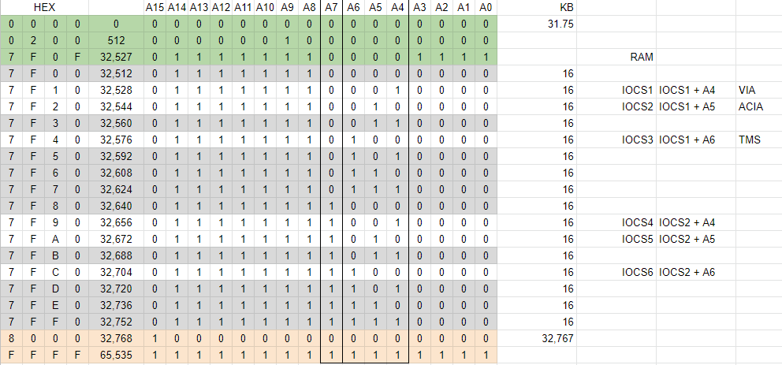

# BE6502-V2 Single Board Computer

This project is a 6502 CPU based single board computer with the following hardware features:

* WDC65C02 CPU
* WDC65C22 Versatile Interface Adapter (VIA)
* 32K Static RAM - Shared with IO
* 32K EEPROM
* [R6551 UART](./docs/UART.md)
* [AY-3-8910](./docs/AY_AUDIO.md) Programmable Sound Generator (PSG)
* [TMS9918A Video Display Processor](./docs/TMS_GRAPHICS.md)
* AT22V10 PLD - Address Decoder
* [PIC16F628A](./docs/PS2_KEYBOARD.md) - Microcontroller for PS/2 Keyboard interface
* Various support logic chips
* Various passive components

The 65C02 and 65C22 devices are well explained in other projects and on the Ben Eater 6502 series of Youtube videos.

As I write this, I realise how much of it is copied from other people.  I have tried to reference where I can.  Most of the code is my own.

I developed Snake entirely on my own.

I followed the tutorial for Snake on a Commodore 64 but adapted it to work with my specific graphics setup.  [https://devdef.blogspot.com/2015/02/tetris-in-6502-assembler-part-1.html](https://devdef.blogspot.com/2015/02/tetris-in-6502-assembler-part-1.html)

## Address Decoding

The usual method of address decoding on a single board computer seems to be to divide the 64k addressable memory into two and share between ROM and RAM.  This is mostly the approach taken here, but rather than use a range of 74 series logic chips to manage the decoding, I have opted for a PLD. (Programmable Logic Device).

The PLD code in this repo divides memory into 4 primary groups:

``` text
RAM       = Address:[0000..7EFF];
IO1       = Address:[7F00..7F7F];
IO2       = Address:[7F80..7FFF];
ROM       = Address:[8000..FFFF];
```

The RAM and ROM lines are assigned to the Chip Select pins on RAM and ROM.  The IO1 and IO2 lines are designed to be used together with additional address lines as follows:



For more detail see the [Schematic](docs/Schematic_be6502_V1.1_2023-02-16.pdf)

## Software

My OS is based on the work by dbuchwald [https://github.com/dbuchwald/6502](https://github.com/dbuchwald/6502)

All software for this project (except for the examples in `basic`) are complied and linked using CA65 and CL65.  I have found that by using CA65 and specifically CL65 as the linker, I have been able to *not* think too much about memory addresses.

The `firmware.cfg` file shows how the memory is mapped and you will see references to these lables in the code.

The simple OS included provides a simple boot menu that allows for:

* upload programs into RAM through the UART using XMODEM
* run the program you uploaded
* start ehBasic
* start wozmon

The ROM offers a range of syscalls that are programmed into a jumptable which can be accessed by user developed applications.

The included Makefile will compile all the ROM libraries, the two available ROM images and all the software in the load folder.

I will leave learning how the CA65 assembler and linker works up to the reader.
